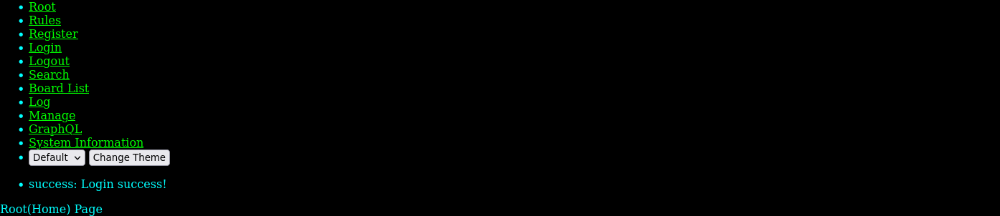
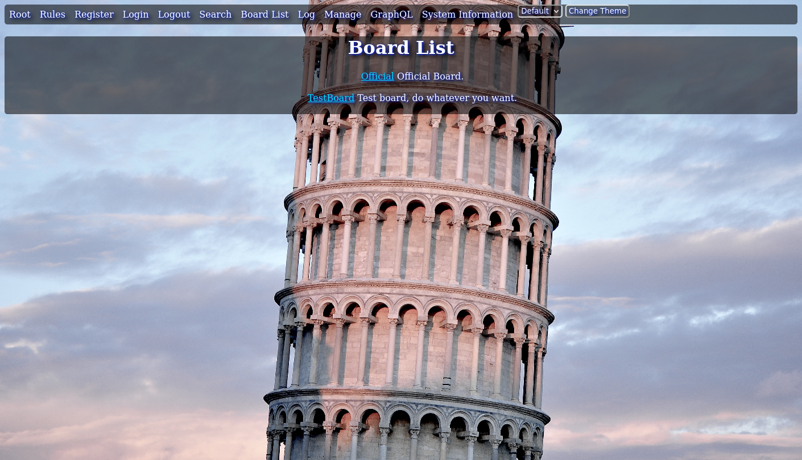
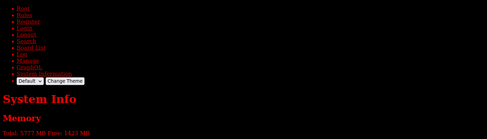
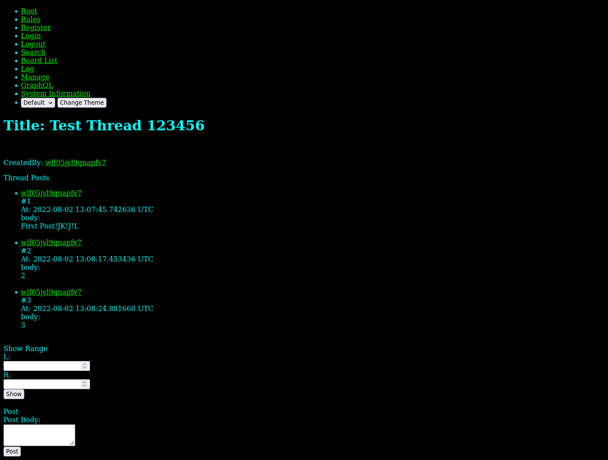

# What is this?
Simple board.
Still incomplete but basic features are done.

# This project is not active currently.
I wrote this to learn Rust and web stuffs.
I've lost my interest.
It's time to learn something for me, instead of writing shitty/cheesy projects/codes.
Might resume someday.


# Features
- Account system
- GraphQL Server
- Token system
- No javascript
- Route guard

# TODO
- [ ] Search feature.(Indexing is done)
- [ ] Rate limiting.
- [ ] CAPTCHA
  
# Code Organization
## migrations
Database schema.

## chan-core
Core codes.
Data models, search functions.
GraphQL server.

## chan-graphql-client
Rust graphql client codes.

## chan-web
Web interface codes.
Internally using one graphql client instance.(Instead of using java script on user side.)

## chan-main
AIO server.
Runs GraphQL and web server(chan-web).


# How to build and run

## Configure .env file
Modify .env file.
You need to modify DATABASE_URL and JWT_SECRET_KEY.

DATABASE_URL is your database url.

JWT_SECRET_KEY is secret key for token system.
You should use strong one for production.


## Build
### dev, debug
```
cargo build
```

### release
```
cargo build --profile release
```

## Run
### migration
Please read diesel's document.  
diesel --help  

### run
```
cd chan-main
cargo run
```


# SS
## Home(Root)


## Board List


## System Information


## Thread



